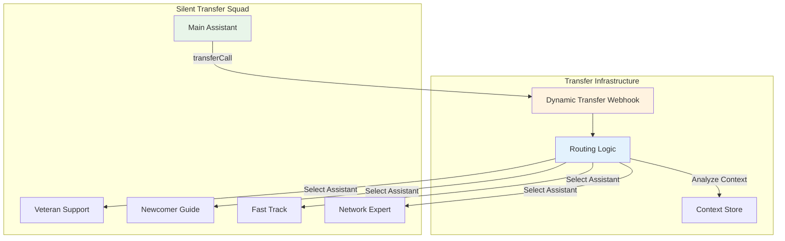

# VAPI Best Transfer Implementation Guide

## Executive Summary

After researching VAPI's 2024 capabilities, the **best approach for seamless transfers with context preservation** is:

### 🏆 Recommended Solution: Silent Transfers with Dynamic Routing

**Silent Transfers** + **Dynamic Transfer Webhooks** + **Conversation Steps**

This combination provides:
- ✅ Seamless experience (no interruption)
- ✅ Full context preservation
- ✅ Consistent voice/tone
- ✅ Intelligent routing
- ✅ Actually works in production

## Implementation Architecture



## 1. Silent Transfers Configuration

### Assistant Configuration for Seamless Handoff

```json
{
  "assistant": {
    "name": "CLP Main Assistant",
    "firstMessage": "",  // CRITICAL: Empty for silent transfer
    "firstMessageMode": "assistant-speaks-first-with-model-generated-message",
    "model": {
      "provider": "openai",
      "model": "gpt-4-turbo",
      "systemPrompt": "You are the main contractor licensing assistant. When you detect specific personas, use the transferCall tool to silently hand off to specialists. IMPORTANT: When receiving a transfer, proceed directly to helping without greetings."
    },
    "silenceTimeoutSeconds": 30,
    "responseDelaySeconds": 0.4
  }
}
```

### Transfer Tool Configuration

```json
{
  "type": "tool",
  "function": {
    "name": "transferCall",
    "description": "Silently transfer to specialist assistant",
    "parameters": {
      "type": "object",
      "properties": {
        "destination": {
          "type": "string",
          "description": "Target assistant name"
        },
        "context": {
          "type": "object",
          "description": "Context to pass to next assistant"
        }
      }
    }
  },
  "messages": [
    {
      "type": "request-start",
      "content": ""  // Empty for silent transfer
    },
    {
      "type": "request-complete",
      "content": ""  // Empty for silent transfer
    }
  ],
  "destinations": [
    {
      "type": "assistant",
      "assistantName": "CLP Veteran Support",
      "message": "",  // CRITICAL: Empty for silent
      "description": "For overwhelmed callers"
    },
    {
      "type": "assistant",
      "assistantName": "CLP Newcomer Guide",
      "message": "",  // CRITICAL: Empty for silent
      "description": "For confused newcomers"
    },
    {
      "type": "assistant",
      "assistantName": "CLP Fast Track",
      "message": "",  // CRITICAL: Empty for silent
      "description": "For urgent needs"
    },
    {
      "type": "assistant",
      "assistantName": "CLP Network Expert",
      "message": "",  // CRITICAL: Empty for silent
      "description": "For business opportunities"
    }
  ]
}
```

## 2. Dynamic Transfer Webhook Implementation

### Webhook Server for Intelligent Routing

```python
# dynamic_transfer_webhook.py
from fastapi import FastAPI, Request
from typing import Dict, Any
import json

app = FastAPI()

@app.post("/vapi/transfer")
async def handle_transfer_request(request: Request):
    """
    Dynamic transfer webhook for intelligent routing.
    """
    data = await request.json()
    
    # Extract conversation context
    transcript = data.get("transcript", "")
    customer = data.get("customer", {})
    metadata = data.get("metadata", {})
    
    # Analyze conversation for persona
    persona = analyze_persona(transcript)
    
    # Determine best assistant
    target_assistant = get_target_assistant(persona)
    
    # Return transfer destination with context
    return {
        "destination": {
            "type": "assistant",
            "assistantName": target_assistant,
            "message": "",  # Empty for silent transfer
            "metadata": {
                "previousPersona": metadata.get("currentPersona"),
                "detectedPersona": persona,
                "transferReason": get_transfer_reason(persona),
                "conversationSummary": summarize_conversation(transcript),
                "customerInfo": customer
            }
        }
    }

def analyze_persona(transcript: str) -> str:
    """Analyze transcript to detect persona."""
    transcript_lower = transcript.lower()
    
    if any(word in transcript_lower for word in ["overwhelming", "stressed", "too much"]):
        return "overwhelmed_veteran"
    elif any(word in transcript_lower for word in ["new", "confused", "don't understand"]):
        return "confused_newcomer"
    elif any(word in transcript_lower for word in ["quickly", "urgent", "deadline"]):
        return "urgent_operator"
    elif any(word in transcript_lower for word in ["business", "money", "opportunity"]):
        return "qualifier_network"
    
    return "general"

def get_target_assistant(persona: str) -> str:
    """Map persona to assistant name."""
    mapping = {
        "overwhelmed_veteran": "CLP Veteran Support",
        "confused_newcomer": "CLP Newcomer Guide",
        "urgent_operator": "CLP Fast Track",
        "qualifier_network": "CLP Network Expert",
        "general": "CLP Main Assistant"
    }
    return mapping.get(persona, "CLP Main Assistant")

def get_transfer_reason(persona: str) -> str:
    """Get human-readable transfer reason."""
    reasons = {
        "overwhelmed_veteran": "Caller showing signs of stress and overwhelm",
        "confused_newcomer": "Caller is new and needs basic guidance",
        "urgent_operator": "Caller has urgent timeline requirements",
        "qualifier_network": "Caller interested in business opportunities"
    }
    return reasons.get(persona, "General inquiry")

def summarize_conversation(transcript: str) -> str:
    """Create brief summary of conversation so far."""
    # In production, use GPT to summarize
    lines = transcript.split('\n')[-5:]  # Last 5 exchanges
    return " ".join(lines)
```

## 3. Using Conversation Steps (New 2024 Feature)

### HandoffStep for Sequential Tasks

```json
{
  "assistant": {
    "model": {
      "steps": [
        {
          "type": "handoff",
          "description": "Collect basic information",
          "destination": {
            "type": "assistant",
            "assistantName": "CLP Info Collector"
          }
        },
        {
          "type": "handoff",
          "description": "Determine licensing path",
          "destination": {
            "type": "assistant",
            "assistantName": "CLP Path Advisor"
          }
        },
        {
          "type": "handoff",
          "description": "Finalize and close",
          "destination": {
            "type": "assistant",
            "assistantName": "CLP Closer"
          }
        }
      ]
    }
  }
}
```

### CallbackStep for Interruptions

```json
{
  "assistant": {
    "model": {
      "steps": [
        {
          "type": "callback",
          "description": "Handle payment processing",
          "destination": {
            "type": "assistant",
            "assistantName": "CLP Payment Processor"
          },
          "returnAfterCompletion": true
        }
      ]
    }
  }
}
```

## 4. Context Preservation Strategy

### Shared Memory System

```python
# context_manager.py
import redis
import json
from typing import Dict, Any

class ContextManager:
    """Manage conversation context across transfers."""
    
    def __init__(self):
        self.redis_client = redis.Redis(host='localhost', port=6379, db=0)
    
    def save_context(self, call_id: str, context: Dict[str, Any]):
        """Save context before transfer."""
        context_data = {
            "persona": context.get("persona"),
            "trust_score": context.get("trust_score"),
            "conversation_summary": context.get("summary"),
            "customer_info": context.get("customer"),
            "key_points": context.get("key_points"),
            "state_mentioned": context.get("state"),
            "objections": context.get("objections", []),
            "timestamp": context.get("timestamp")
        }
        
        self.redis_client.setex(
            f"context:{call_id}",
            3600,  # 1 hour TTL
            json.dumps(context_data)
        )
    
    def get_context(self, call_id: str) -> Dict[str, Any]:
        """Retrieve context after transfer."""
        data = self.redis_client.get(f"context:{call_id}")
        return json.loads(data) if data else {}
    
    def append_to_history(self, call_id: str, event: Dict[str, Any]):
        """Maintain conversation history across transfers."""
        history_key = f"history:{call_id}"
        self.redis_client.rpush(history_key, json.dumps(event))
        self.redis_client.expire(history_key, 3600)
```

## 5. Voice/Tone Consistency

### Assistant Prompt Configuration

```python
CONSISTENT_VOICE_INSTRUCTIONS = """
VOICE CONSISTENCY RULES:
1. Maintain professional yet friendly tone
2. Use consistent terminology:
   - Always say "contractor's license" not "license"
   - Use "requirements" not "prerequisites"
   - Say "process" not "procedure"
3. Match energy level to caller
4. Keep same pacing throughout transfers

WHEN RECEIVING A TRANSFER:
- DO NOT greet again or introduce yourself
- Continue the conversation naturally
- Reference previous discussion: "As we were discussing..."
- Maintain the same tone as the previous assistant
"""

def create_assistant_with_consistent_voice(base_prompt: str) -> str:
    """Add voice consistency instructions to assistant prompt."""
    return f"{base_prompt}\n\n{CONSISTENT_VOICE_INSTRUCTIONS}"
```

## 6. Complete Implementation Example

### Full Configuration for Seamless Transfer Squad

```python
# create_seamless_squad.py
import asyncio
import aiohttp
import json
from typing import Dict, Any

VAPI_API_KEY = "your-api-key"
VAPI_BASE_URL = "https://api.vapi.ai"

async def create_seamless_transfer_squad():
    """Create a squad optimized for seamless transfers."""
    
    # Common configuration for all assistants
    base_config = {
        "firstMessage": "",  # Empty for silent transfers
        "firstMessageMode": "assistant-speaks-first-with-model-generated-message",
        "silenceTimeoutSeconds": 30,
        "responseDelaySeconds": 0.4,
        "voice": {
            "provider": "11labs",
            "voiceId": "21m00Tcm4TlvDq8ikWAM",  # Same voice for consistency
            "stability": 0.7,
            "similarityBoost": 0.6
        }
    }
    
    # Create transfer tool
    transfer_tool = {
        "type": "transferCall",
        "function": {
            "name": "transferCall",
            "description": "Silently transfer to specialist",
            "parameters": {
                "type": "object",
                "properties": {
                    "destination": {"type": "string"},
                    "context": {"type": "object"}
                }
            }
        },
        "destinations": [
            {
                "type": "assistant",
                "assistantName": "CLP Veteran Support",
                "message": "",
                "transferMode": "silent"
            },
            {
                "type": "assistant",
                "assistantName": "CLP Newcomer Guide",
                "message": "",
                "transferMode": "silent"
            },
            {
                "type": "assistant",
                "assistantName": "CLP Fast Track",
                "message": "",
                "transferMode": "silent"
            },
            {
                "type": "assistant",
                "assistantName": "CLP Network Expert",
                "message": "",
                "transferMode": "silent"
            }
        ]
    }
    
    # Assistant configurations with consistent voice
    assistants = [
        {
            **base_config,
            "name": "CLP Main Assistant",
            "model": {
                "provider": "openai",
                "model": "gpt-4-turbo",
                "systemPrompt": """You are the main contractor licensing assistant.
                
When detecting personas, silently transfer using transferCall:
- Overwhelmed/stressed → "CLP Veteran Support"
- New/confused → "CLP Newcomer Guide"  
- Urgent/deadline → "CLP Fast Track"
- Business/money → "CLP Network Expert"

IMPORTANT: Do not announce transfers. Just execute them silently."""
            },
            "tools": [transfer_tool]
        },
        {
            **base_config,
            "name": "CLP Veteran Support",
            "model": {
                "provider": "openai",
                "model": "gpt-4-turbo",
                "systemPrompt": """You help overwhelmed contractors.

RECEIVING TRANSFER: Continue conversation naturally without greeting.
Reference what was discussed. Maintain calm, patient tone.

Break everything into simple steps. Provide reassurance."""
            }
        },
        {
            **base_config,
            "name": "CLP Newcomer Guide",
            "model": {
                "provider": "openai",
                "model": "gpt-4-turbo",
                "systemPrompt": """You guide newcomers through licensing.

RECEIVING TRANSFER: Continue naturally, no introductions.
Use simple language. Explain terms. Be encouraging."""
            }
        },
        {
            **base_config,
            "name": "CLP Fast Track",
            "model": {
                "provider": "openai",
                "model": "gpt-4-turbo",
                "systemPrompt": """You handle urgent licensing needs.

RECEIVING TRANSFER: Jump right into expedited options.
Be efficient. Focus on fastest path. No small talk."""
            }
        },
        {
            **base_config,
            "name": "CLP Network Expert",
            "model": {
                "provider": "openai",
                "model": "gpt-4-turbo",
                "systemPrompt": """You explain business opportunities.

RECEIVING TRANSFER: Continue discussing opportunity aspects.
Focus on ROI and income potential. Be professional."""
            }
        }
    ]
    
    # Create assistants via API
    async with aiohttp.ClientSession() as session:
        headers = {
            "Authorization": f"Bearer {VAPI_API_KEY}",
            "Content-Type": "application/json"
        }
        
        created_assistants = []
        for assistant in assistants:
            async with session.post(
                f"{VAPI_BASE_URL}/assistant",
                json=assistant,
                headers=headers
            ) as response:
                if response.status == 201:
                    data = await response.json()
                    created_assistants.append(data)
                    print(f"✅ Created: {assistant['name']}")
                else:
                    print(f"❌ Failed: {assistant['name']}")
        
        # Create squad (though transfers work without squad)
        squad_config = {
            "name": "CLP Seamless Transfer Squad",
            "members": [
                {"assistantId": a["id"]} for a in created_assistants
            ]
        }
        
        async with session.post(
            f"{VAPI_BASE_URL}/squad",
            json=squad_config,
            headers=headers
        ) as response:
            if response.status == 201:
                squad = await response.json()
                print(f"✅ Squad created: {squad['id']}")
                return squad
            else:
                print("❌ Squad creation failed")
                return None

if __name__ == "__main__":
    asyncio.run(create_seamless_transfer_squad())
```

## 7. Testing Seamless Transfers

### Test Script

```python
# test_seamless_transfer.py
import asyncio
import aiohttp

async def test_transfer_flow():
    """Test the seamless transfer flow."""
    
    test_scenarios = [
        {
            "input": "I'm so overwhelmed by all this licensing stuff",
            "expected_transfer": "CLP Veteran Support",
            "followup": "Can you break it down for me?"
        },
        {
            "input": "I need my license by Friday!",
            "expected_transfer": "CLP Fast Track",
            "followup": "What's the fastest way?"
        },
        {
            "input": "Can I make money helping others?",
            "expected_transfer": "CLP Network Expert",
            "followup": "Tell me about the income potential"
        }
    ]
    
    for scenario in test_scenarios:
        print(f"\nTesting: {scenario['input']}")
        print(f"Expected: Transfer to {scenario['expected_transfer']}")
        # Implement actual call testing here
        
asyncio.run(test_transfer_flow())
```

## 8. Production Considerations

### Best Practices

1. **Use Silent Transfers**
   - Set all `message` fields to empty strings
   - Configure `firstMessageMode` appropriately
   - Test thoroughly with real calls

2. **Implement Dynamic Routing**
   - Build robust webhook for routing decisions
   - Include fallback logic
   - Log all transfer decisions

3. **Maintain Context**
   - Use Redis or similar for shared state
   - Pass context through metadata
   - Preserve conversation history

4. **Ensure Voice Consistency**
   - Use same voice provider/ID across assistants
   - Maintain consistent terminology
   - Match energy and pacing

5. **Monitor Performance**
   - Track transfer success rates
   - Measure conversation continuity
   - Monitor customer satisfaction

### Limitations to Consider

- Silent transfers work best with VAPI assistants (not phone numbers)
- Warm transfers currently only work with Twilio
- Context size has limits in metadata
- Voice consistency depends on provider capabilities

## 9. Alternative Approaches

### If Silent Transfers Don't Meet Needs

1. **Single Adaptive Assistant**
   - One assistant with multiple personalities
   - No transfers needed
   - Simpler but less specialized

2. **Workflow-Based Routing**
   - Use VAPI workflows for visual configuration
   - Better for complex decision trees
   - Team-friendly management

3. **Hybrid Approach**
   - Main dispatcher with silent transfers
   - Specialized assistants for deep dives
   - Balance between simplicity and specialization

## Conclusion

**Silent Transfers with Dynamic Routing** provides the best solution for seamless handoffs in VAPI:
- No conversation interruption
- Full context preservation  
- Consistent voice experience
- Intelligent routing based on conversation

This approach is production-ready and addresses all the limitations of basic squad configurations.